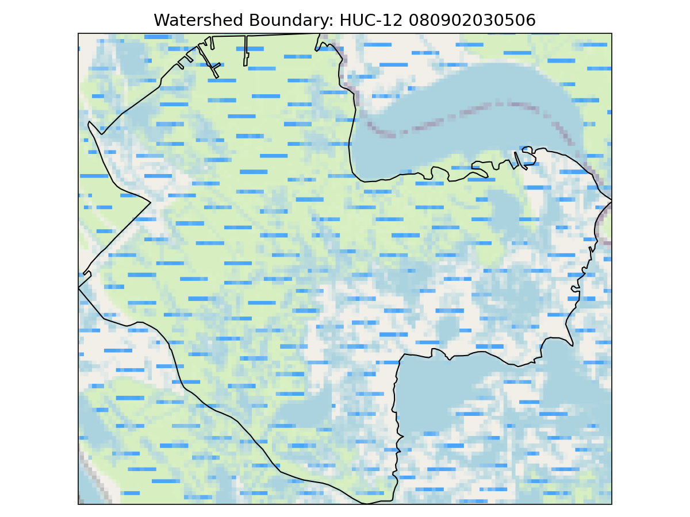
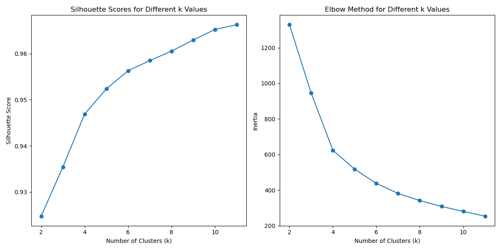
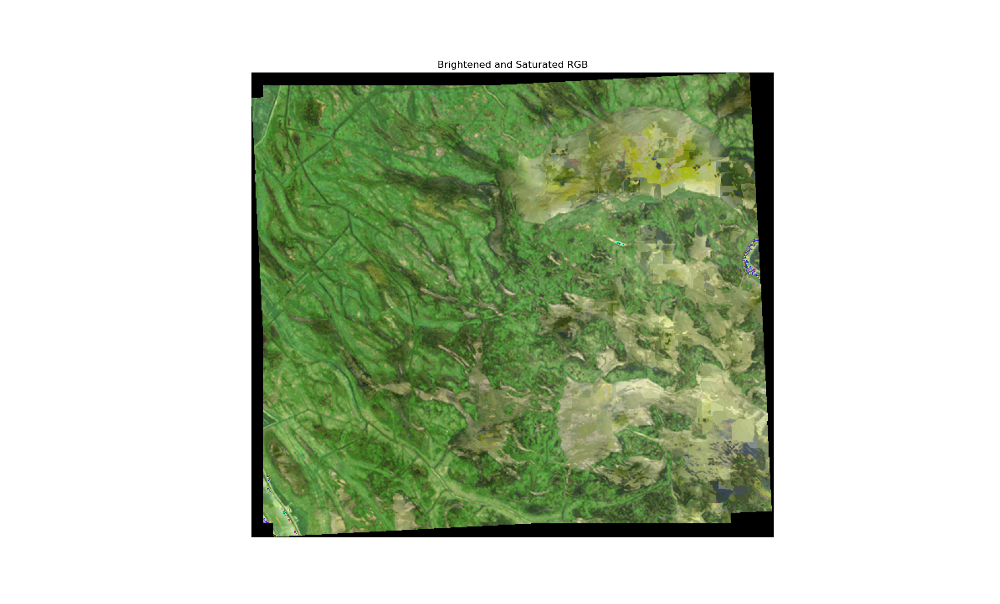
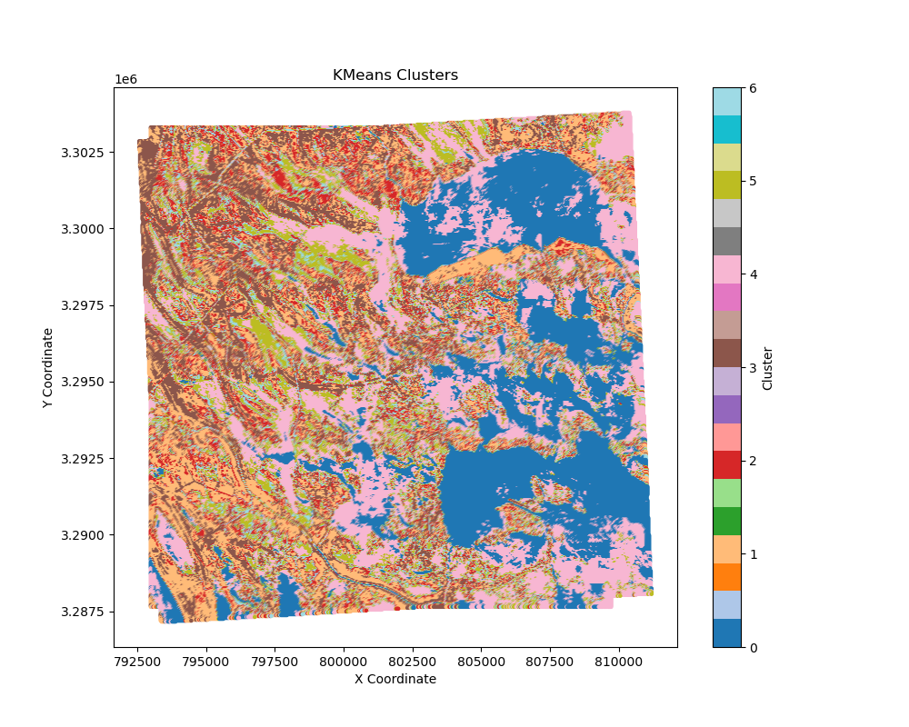

### SITE DESCRIPTION

For this assignment we downloaded the Water Boundary Dataset for region 8 located in Mississippi (specifically watershed 080902030506). This watershed covers part of New Orleans and is near the Mississippi Delta. This is a good area to practice land classification since deltas provide a diverse spread of land cover. The Mississippi Delta includes uplands, the Gulf of Mexico, forests, mash, beaches, and urban areas. Please note that I was unable to figure out how to load in satellite imagery under my watershed boundary so I used OpenStreetMap (OSM)

  
#### Citations:  
National Wildlife Federation. (n.d.). Mississippi River Delta. National Wildlife Federation. https://www.nwf.org/Educational-Resources/Wildlife-Guide/Wild-Places/Mississippi-River-Delta

### SILHOUETTE AND ELBOW PLOTS

In order to help determine the number of clusters I wanted to use in my K means calculation I used a combination of the Elbow Method and a Silhouette Score. For the Elbow Method I calculated and plotted the within-cluster sum of squares (WCSS) or inertia, as it is know in the Sklearn package, against different values of K, and then visually identified the "elbow" on the plot where the rate of decrease sharply changes and begins to flatten out, which is somewhere around 6 or 7 clusters. For the Silhouette Score I looked for values that were closer to one, which represented a more dense and well-separated cluster. However, they seemed to trail off closer and closer to 1 - so I went with 7 clusters in an attempt to get discrete land classification groups, while also trying not to over classify the data. 

### RGB AND CLUSTER PLOTS

  
  I plotted both the RGB color bands (after they had been brightened and saturated) and the K means clusters to see how they visually compared. It looks like the K means clusters were able to cluster together more open farm area, roads, and it seems to follow elevation changes - but it is hard to tell how accurate it is exactly without trained data or a more interactive map/information about the area. Additionally, there are some strange color markings in the RGB map - which I would assume is water, but doesn't look like it has been classed as its own group in the K means plot. This is likely because I struggled to get my NaN values to drop appropriately.
